<div align="center">

```
╔═══════════════════════════════════════════════════════════════╗
║                                                               ║
║        🕷️  R U S T   S I T E M A P   C R A W L E R  🕷️        ║
║                                                               ║
║          The Web Explorer That Never Gets Lost                ║
║                                                               ║
╚═══════════════════════════════════════════════════════════════╝
```


**A high-performance, lock-free web crawler that maps entire websites with mathematical precision**

[Features](#-features) • [Quick Start](#-quick-start) • [The Magic](#-the-magic-tricks) • [Legal Warning](#-legal--ethical-warning)

</div>

---

## 🎯 What Does This Thing Actually Do?

> **Imagine you're an explorer with a magic map that draws itself as you walk.**

You start at one treasure chest (a website). When you open it, you find notes pointing to MORE treasure chests. Your job? Visit every single chest, write down what's inside, and draw lines showing how they're all connected.

**That's what this crawler does—but FAST, and without ever getting lost or visiting the same chest twice.**

### The Three Magic Powers:

🎒 **The Memory Trick**
Most explorers need a HUGE backpack to remember everything. This one uses a special diary (disk storage) that never runs out of pages, so it only carries what it needs right now.

⚡ **The Speed Secret**
Instead of one explorer, you send **256 tiny robot explorers** who work at the same time. When one finds a slow treasure chest that takes forever to open, they don't wait—they just tell another robot to handle it and move on to the next one!

🚫 **The No-Loop-De-Loop Rule**
There's a magical bloom filter (like a super-smart checklist) that instantly knows if you've been somewhere before, so you NEVER waste time visiting the same place twice. Ever. **Impossible.**

---

## ✨ Features

<table>
<tr>
<td width="33%" align="center">

### 🚀 Blazing Fast
**256 concurrent workers**
Non-blocking async architecture
500K+ in-flight URLs

</td>
<td width="33%" align="center">

### 🔒 Memory Safe
**Zero race conditions**
Rust's borrow checker
Lock-free data structures

</td>
<td width="33%" align="center">

### 🧠 Smart
**Triple-layer dedup**
Domain-level backoff
Robots.txt compliance

</td>
</tr>
</table>

- ⚡ **BFS Crawler**: Systematic breadth-first traversal ensuring complete coverage
- 💾 **Memory Efficient**: Uses [rkyv](https://github.com/rkyv/rkyv) for zero-copy serialization
- 🔄 **Persistent Queue**: Spills to disk automatically when memory limits reached
- 🗺️ **Node Map**: Tracks all discovered URLs with O(1) duplicate detection
- 🛡️ **Download-Aware**: Skips binaries, large assets, and non-HTML content
- 📊 **JSONL Export**: Export complete sitemap in JSONL format
- 🤖 **Robots.txt**: Respects robots.txt by default (configurable)
- 📝 **No Depth Limits**: Crawls entire site regardless of depth
- 💾 **Auto Checkpoints**: Periodic stats reporting with configurable intervals

---

## 📚 Table of Contents

- [What Does This Thing Actually Do?](#-what-does-this-thing-actually-do)
- [Features](#-features)
- [Quick Start](#-quick-start)
- [The Magic Tricks](#-the-magic-tricks-advanced-features-explained)
- [A Note on Rust](#-a-note-on-rust-the-big-boss-battle)
- [The Journey of a URL](#️-the-journey-of-a-url)
- [Command-Line Options](#-command-line-options)
- [Output Format](#-output-format)
- [Performance](#-performance)
- [**LEGAL & ETHICAL WARNING**](#-legal--ethical-warning)
- [Library Usage](#-library-usage)
- [Architecture](#-architecture)
- [Contributing](#-contributing)

---

## 🚀 Quick Start

### Installation

```bash
# Clone the repository
git clone https://github.com/yourusername/rust-sitemap.git
cd rust-sitemap

# Build release version
cargo build --release
```

### Basic Crawl

```bash
# Crawl a website (respects robots.txt)
cargo run --release -- crawl --start-url https://example.com
```

### Full Options Example

```bash
cargo run --release -- crawl \
  --start-url https://example.com \
  --data-dir ./crawl_data \
  --workers 256 \
  --rate-limit 200 \
  --timeout 45 \
  --user-agent "MyBot/1.0" \
  --export-jsonl
```

### Export Existing Crawl

```bash
cargo run --release -- orient-map \
  --data-dir ./crawl_data \
  --output ./sitemap.jsonl
```

---

## 🎪 The Magic Tricks (Advanced Features Explained)

<details>
<summary><b>🎭 Magic Trick #1: The "Spawn-and-Forget" Pattern</b></summary>

### What's Happening?

Workers don't wait for slow pages. They spawn async background tasks and **immediately** grab the next URL from the queue.

### The Restaurant Analogy

> Think of a restaurant where waiters don't stand at your table waiting for you to finish eating. They take your order, throw it to the kitchen (a background task), and immediately help the next customer. That's why this crawler can handle 256+ workers without anyone twiddling their thumbs.

### Code Reference

📍 **Implementation**: [`bfs_crawler.rs:497-511`](src/bfs_crawler.rs#L497-L511)
📍 **Background processing**: [`bfs_crawler.rs:512-638`](src/bfs_crawler.rs#L512-L638)

### Why It's Cool

✅ Fast URLs don't get blocked by slow ones
✅ Exponential throughput scaling
✅ Workers always busy (never idle)

```rust
// Worker spawns task and moves on immediately
tokio::spawn(async move {
    process_url(&url).await; // This can take 45 seconds...
    // Meanwhile, worker already grabbed 10 more URLs!
});
```

</details>

<details>
<summary><b>🔍 Magic Trick #2: Triple-Layer Deduplication</b></summary>

### The Three Bouncers at the Club

> Imagine three different bouncers at a club:
>
> 1. **Bloom** (the fast one): "Have I seen your face? Nope? Come in!" Takes 0.00001 seconds.
> 2. **Sled** (the permanent records guy): "Let me check the VIP list on the hard drive." 100% accurate.
> 3. **DashMap** (the memory): "I remember you from 5 minutes ago!" Super fast, but forgets when you close the club.
>
> Together, they make it **IMPOSSIBLE** to sneak in twice.

### Technical Breakdown

| Layer | Type | Purpose | Performance |
|-------|------|---------|-------------|
| **Bloom Filter** | Probabilistic | Fast "definitely not seen" check | O(1), 10M URLs in ~10MB |
| **Sled DB** | Persistent | Authoritative dedup | O(log n), disk-backed |
| **DashMap** | In-Memory | Hot node cache | O(1), lock-free |

### Code Reference

📍 **Bloom setup**: [`node_map.rs:98-100`](src/node_map.rs#L98-L100)
📍 **Triple-check logic**: [`node_map.rs:126-139`](src/node_map.rs#L126-L139)
📍 **Lock-free DashMap**: [`node_map.rs:68-70`](src/node_map.rs#L68-L70)

### Why It's Cool

✅ Mathematically guaranteed zero-loop crawling
✅ Can crawl billions of pages without duplicates
✅ 0.01% false positive rate (caught by Sled)

```rust
// Fast path: Bloom filter (concurrent read)
if self.bloom.read().check(&url) {
    // Maybe seen - check Sled for certainty
    if sled_db.contains(&url) {
        return false; // Definitely seen before
    }
}
// Definitely new - add to all three layers
```

</details>

<details>
<summary><b>⏱️ Magic Trick #3: Exponential Backoff with Domain-Level Rate Limiting</b></summary>

### The Polite Knocker

> If a website keeps slamming the door in your face, you don't keep knocking every second like a weirdo. You back off.
>
> - **First failure**: Knock again in 2 seconds
> - **Second failure**: Wait 4 seconds
> - **Third failure**: Wait 8 seconds
> - **Fifth failure**: Give up and move to other websites
>
> Meanwhile, you NEVER send more than 5 friends to knock on the same door at once. Polite AND efficient.

### Backoff Formula

```
backoff_seconds = 2^failures (max 300 seconds)
```

| Failures | Backoff Time |
|----------|--------------|
| 1 | 2s |
| 2 | 4s |
| 3 | 8s |
| 4 | 16s |
| 5+ | Permanently blocked |

### Code Reference

📍 **Domain failure tracker**: [`bfs_crawler.rs:18-124`](src/bfs_crawler.rs#L18-L124)
📍 **Exponential backoff**: [`bfs_crawler.rs:54-58`](src/bfs_crawler.rs#L54-L58)
📍 **Per-domain limits**: [`bfs_crawler.rs:75-100`](src/bfs_crawler.rs#L75-L100)

### Why It's Cool

✅ Prevents hammering slow/dead domains
✅ Keeps fast domains at full throttle
✅ Auto-bans problematic servers

</details>

<details>
<summary><b>🚄 Magic Trick #4: Kanal Channels + Rkyv Serialization</b></summary>

### The Pneumatic Tube System

> **Kanal** is like a massive pneumatic tube system in a 1920s department store—**500,000 canisters** flying through the air at once, and nobody ever bumps into each other. No traffic lights needed (lock-free!).
>
> **Rkyv** is the magic: instead of writing messages in English that you have to read (slow), you write in a secret code that you can just GLANCE at and instantly understand. It's like downloading RAM instead of parsing JSON.

### Technical Details

| Feature | Technology | Benefit |
|---------|------------|---------|
| Channel | [Kanal](https://github.com/fereidani/kanal) MPMC | Lock-free, 500K capacity |
| Serialization | [Rkyv](https://github.com/rkyv/rkyv) | Zero-copy deserialization |
| Queue Storage | Rkyv persistent | Disk spillover when full |

### Code Reference

📍 **Kanal setup**: [`bfs_crawler.rs:210-214`](src/bfs_crawler.rs#L210-L214)
📍 **Rkyv queue**: [`rkyv_queue.rs:44-69`](src/rkyv_queue.rs#L44-L69)
📍 **Zero-copy**: [`rkyv_queue.rs:173`](src/rkyv_queue.rs#L173)

### Why It's Cool

✅ 500K+ in-flight URLs with zero copying
✅ Zero lock contention
✅ Instant serialization/deserialization

```rust
// Zero-copy deserialization (no parsing!)
let url: QueuedUrl = unsafe {
    rkyv::from_bytes_unchecked(&bytes)
};
```

</details>

<details>
<summary><b>🌐 Magic Trick #5: Optional Redis Distributed Locking</b></summary>

### The Shared Whiteboard in the Cloud

> Want to crawl with a friend on another computer? No problem.
>
> Redis is like a shared whiteboard in the cloud where everyone writes **"DIBS!"** before visiting a URL. If someone else already wrote dibs, you skip it. Simple.
>
> No double-work, even across continents.

### How It Works


### Code Reference

📍 **Redis manager**: [`url_lock_manager.rs:1-140`](src/url_lock_manager.rs)
📍 **Atomic lock**: [`url_lock_manager.rs:34-54`](src/url_lock_manager.rs#L34-L54)
📍 **Worker integration**: [`bfs_crawler.rs:474-492`](src/bfs_crawler.rs#L474-L492)

### Why It's Cool

✅ Scales horizontally (10 servers = 10x faster)
✅ Zero duplicate work across machines
✅ Automatic lock expiry (TTL-based)

</details>

<details>
<summary><b>🔁 Magic Trick #6: Intelligent Retry Logic</b></summary>

### Some Problems Fix Themselves, Some Don't

> The crawler knows the difference:
>
> - **Timeout**: "Maybe the server was busy. Let me try again in 500ms, then 1 second."
> - **DNS Error**: "This website doesn't exist. Moving on forever."
> - **SSL Error**: "Broken certificate. Nope, not retrying."

### Error Classification

| Error Type | Retryable? | Reason |
|------------|------------|--------|
| Timeout | ✅ Yes | Transient network issue |
| Broken pipe | ✅ Yes | Connection hiccup |
| DNS failure | ❌ No | Domain doesn't exist |
| SSL/TLS error | ❌ No | Certificate problem |
| Connection refused | ❌ No | Server blocking us |

### Code Reference

📍 **Error classification**: [`network.rs:143-169`](src/network.rs#L143-L169)
📍 **Retry logic**: [`network.rs:47-74`](src/network.rs#L47-L74)
📍 **Retryable check**: [`network.rs:206-227`](src/network.rs#L206-L227)

### Why It's Cool

✅ Doesn't waste time on permanent failures
✅ Respects transient network hiccups
✅ Exponential backoff (500ms, 1s)

</details>

<details>
<summary><b>🤖 Magic Trick #7: Robots.txt Parsing</b></summary>

### Perfect Manners in Every House

> The crawler reads the website's "house rules" sign (robots.txt) before entering:
>
> - "No entry to `/admin/*`"? Respectfully skips it.
> - "Googlebot allowed in `/secret/`, but everyone else out"? Checks if it's Googlebot first.
> - Pattern like `/temp*$`? Converts it to regex and matches perfectly.
>
> It's like having perfect manners in every house you visit.

### Supported Features

✅ Wildcard patterns (`*`)
✅ End-of-line markers (`$`)
✅ Per-user-agent rules
✅ Allow/Disallow directives

### Code Reference

📍 **Parser**: [`robots.rs:1-242`](src/robots.rs)
📍 **Wildcard conversion**: [`robots.rs:91-107`](src/robots.rs#L91-L107)
📍 **URL checking**: [`robots.rs:109-142`](src/robots.rs#L109-L142)

### Why It's Cool

✅ Ethical crawling
✅ Won't get you banned
✅ Respects server rules

</details>

---

## 🐉 A Note on Rust (The Big Boss Battle)

### Why Building This in Rust Was Like Taming a Dragon

**Let me be honest: Rust is HARD.**

It's like playing a video game where the tutorial boss (the borrow checker) refuses to let you pass until you truly understand the rules. No shortcuts. No "I'll fix it later." You can't just slap together code and hope it works.

### The Struggle

**The Compiler Fights You:**

```diff
- error[E0502]: cannot borrow `x` as mutable because it is also borrowed as immutable
- error[E0597]: `y` does not live long enough
- error[E0382]: borrow of moved value: `z`
```

Every. Single. Time.

> There were moments debugging lifetime errors where I questioned my life choices.

### The Victory

**But here's the thing:** once the compiler ACCEPTS your code, it just... **WORKS**.

✅ No race conditions
✅ No mysterious crashes
✅ No memory leaks
✅ No "works on my machine" bugs

### The Proof

| What I Wanted | What Rust Said | Result |
|---------------|----------------|--------|
| Lock-Free Concurrency | "Prove it's safe" | ✅ Compiler-verified safety |
| 256 Workers | "Show me the lifetimes" | ✅ Zero data races (guaranteed) |
| Shared State | "This needs Arc<Mutex<T>>" | ✅ No crashes, ever |

### The Lesson

> That "dragon" you fought? It was actually a **strict teacher** making sure you learned to code correctly. And now your code is bulletproof.

**Would I do it again?**

**Absolutely.** Because after taming the Rust dragon, you don't just have code—you have *reliable*, *fast*, *correct* code that won't wake you up at 3 AM with production bugs.

---

## 🗺️ The Journey of a URL

### From Input to Export: A Complete Trace

Let's follow `https://example.com` through the entire system.

```mermaid
graph TD
    A[🌐 User Input<br/>example.com] --> B[📝 Normalize URL<br/>https://example.com]
    B --> C[🏗️ Initialize Crawler<br/>Create NodeMap, Queue, Workers]
    C --> D[🔍 Bloom Filter Check<br/>Have we seen this?]
    D -->|New URL| E[💾 Add to All Three Layers<br/>Bloom + Sled + DashMap]
    D -->|Seen Before| Z[❌ Skip URL]
    E --> F[📬 Send to Kanal Channel<br/>500K capacity MPMC]
    F --> G[👷 Worker Receives URL<br/>Non-blocking receive]
    G --> H{🚦 Domain Check}
    H -->|Too Many Failures| Z
    H -->|In Backoff| Z
    H -->|OK| I[🎟️ Acquire Rate Limit Permit<br/>Tokio Semaphore]
    I --> J[🚀 Spawn Background Task<br/>Worker moves to next URL]
    J --> K[📡 HTTP Fetch<br/>Hyper + TLS]
    K --> L{📋 Robots.txt Check}
    L -->|Disallowed| M[❌ Skip & Record]
    L -->|Allowed| N[📄 Download HTML<br/>Max 10MB]
    N --> O[🔍 Parse Links<br/>Scraper crate]
    O --> P[🔗 Convert to Absolute URLs<br/>Resolve relative paths]
    P --> Q[🎯 Filter by Domain<br/>Same domain only]
    Q --> R[🚫 Filter by Extension<br/>Skip .pdf, .jpg, etc]
    R --> D
    N --> S[💾 Update NodeMap<br/>Store metadata]
    S --> T[✅ Mark as Processed]
    T --> U{🎬 More URLs?}
    U -->|Yes| F
    U -->|No| V[💾 Save State<br/>Flush to disk]
    V --> W[📊 Export JSONL<br/>Final output]

    K -->|Error| X[⚠️ Classify Error]
    X -->|Retryable| Y[⏱️ Retry with Backoff]
    X -->|Permanent| AA[📝 Record Failure<br/>Domain backoff]
    Y --> K
    AA --> AB[🔴 Exponential Backoff<br/>2^failures seconds]

    style A fill:#4ECDC4
    style W fill:#95E1D3
    style Z fill:#F38181
    style J fill:#FFE66D
```



### Step-by-Step Breakdown

<details>
<summary><b>Step 1: Entry Point</b> (<code>main.rs</code>)</summary>

**What Happens:**

1. User provides `https://example.com`
2. URL normalized (adds `https://` if missing)
3. `BfsCrawlerConfig` created with settings:
   - 256 workers
   - 200 req/s rate limit
   - 45s timeout
4. `BfsCrawlerState::new()` initializes the system

**Code**: [`main.rs:34-95`](src/main.rs#L34-L95)

</details>

<details>
<summary><b>Step 2: Crawler Initialization</b> (<code>bfs_crawler.rs</code>)</summary>

**What Happens:**

1. **HTTP Client Created**
   - Hyper with TLS support
   - Connection pooling (16 idle per host, 30s keepalive)
   - Code: [`network.rs:18-43`](src/network.rs#L18-L43)

2. **Rate Limiter**
   - Tokio semaphore with 200 permits
   - Code: [`bfs_crawler.rs:197`](src/bfs_crawler.rs#L197)

3. **NodeMap Initialized** (Lock-Free Triple-Layer)
   - Bloom filter (10M capacity, 0.01% FP rate)
   - Sled DB for persistent dedup
   - DashMap for in-memory nodes
   - Code: [`node_map.rs:87-114`](src/node_map.rs#L87-L114)

4. **Persistent Queue** (Rkyv)
   - Stores URLs that spill from memory
   - Code: [`rkyv_queue.rs:52-69`](src/rkyv_queue.rs#L52-L69)

5. **Kanal Channels**
   - 500K+ capacity MPMC async channel
   - Code: [`bfs_crawler.rs:213-214`](src/bfs_crawler.rs#L213-L214)

6. **Domain Failure Tracker**
   - Per-domain backoff and concurrency limits
   - Code: [`bfs_crawler.rs:216-219`](src/bfs_crawler.rs#L216-L219)

**Code**: [`bfs_crawler.rs:185-256`](src/bfs_crawler.rs#L185-L256)

</details>

<details>
<summary><b>Step 3: First URL Queued</b> (<code>bfs_crawler.rs::initialize</code>)</summary>

**What Happens:**

1. Start URL added to NodeMap
   - Bloom filter marked ✓
   - Sled DB records it ✓
   - DashMap stores metadata ✓

2. `QueuedUrl` created (depth=0, parent=None)

3. Sent to BOTH:
   - Persistent queue (Rkyv)
   - Kanal channel (in-flight)

4. **Robots.txt Fetched** (if enabled)
   - Fetches `https://example.com/robots.txt`
   - Parses rules for user-agent

**Code**: [`bfs_crawler.rs:259-290`](src/bfs_crawler.rs#L259-L290)

</details>

<details>
<summary><b>Step 4: Workers Spawned</b> (<code>bfs_crawler.rs::start_crawling</code>)</summary>

**What Happens:**

1. 256 worker tasks spawned (`tokio::spawn`)
2. Each worker enters infinite loop:

```rust
loop {
    // Receive URL from Kanal channel (lock-free, zero-copy)
    let url = url_receiver.recv().await;

    // Check domain failure tracker
    if should_skip_domain(&url) { continue; }

    // Acquire rate limiter permit
    let permit = rate_limiter.acquire().await;

    // SPAWN BACKGROUND TASK to fetch URL
    tokio::spawn(async move {
        process_url(url).await;
    });

    // IMMEDIATELY grab next URL (non-blocking!)
}
```

**Performance Secret:**

Workers never wait for slow pages. Fast URLs feed workers continuously → **exponential throughput**.

**Code**: [`bfs_crawler.rs:293-314`](src/bfs_crawler.rs#L293-L314) and [`bfs_crawler.rs:393-681`](src/bfs_crawler.rs#L393-L681)

</details>

<details>
<summary><b>Step 5: URL Processed in Background Task</b></summary>

**What Happens (in async background task):**

1. **Robots.txt Check**: Is URL allowed?
   - Code: [`bfs_crawler.rs:691-695`](src/bfs_crawler.rs#L691-L695)

2. **HTTP Fetch** with retry logic:
   - Up to 3 attempts with exponential backoff
   - Timeout enforcement (45 seconds)
   - Error classification (retryable vs permanent)
   - Content-Length check (reject if >10MB)
   - Code: [`network.rs:47-74`](src/network.rs#L47-L74)

3. **HTML Parsing**:
   - Extract all `<a href>` tags
   - Filter out `javascript:`, `mailto:`, `tel:`, etc.
   - Code: [`parser.rs:19-44`](src/parser.rs#L19-L44)

4. **Link Discovery**:
   - Convert relative → absolute URLs
   - Filter by domain (same-domain only)
   - Filter by extension (skip `.pdf`, `.jpg`, etc.)

5. **Deduplication** (Lock-Free!):
   - Check bloom filter (read lock)
   - Check Sled DB if bloom says "maybe"
   - Add to all three layers if new
   - Code: [`node_map.rs:126-160`](src/node_map.rs#L126-L160)

6. **Queue New URLs**:
   - Send to Kanal channel
   - Depth = parent_depth + 1

7. **Update NodeMap**:
   - Store title, status code, links, content-type

**Code**: [`bfs_crawler.rs:512-638`](src/bfs_crawler.rs#L512-L638)

</details>

<details>
<summary><b>Step 6: Failure Handling</b></summary>

**What Happens on Error:**

1. **Error Classification**:
   - Timeout → "⏱️ Timeout"
   - Connection refused → "❌ Connection refused"
   - DNS error → "🌐 DNS error"
   - SSL error → "🔒 SSL/TLS error"

2. **Domain Failure Recorded**:
   - Increment failure count
   - Set backoff timer: `2^failures` seconds (max 300s)

3. **Backoff Enforcement**:
   - Future requests to this domain blocked until backoff expires
   - After 5 failures: permanently blocked

**Code**: [`bfs_crawler.rs:599-623`](src/bfs_crawler.rs#L599-L623)

</details>

<details>
<summary><b>Step 7: Completion & Export</b></summary>

**What Happens:**

1. All workers detect empty channel → exit loop
2. Final stats collected (lock-free atomic reads)
3. `save_state()`: Flush NodeMap to disk, clear queue
4. `export_to_jsonl()`:
   - Read all nodes from memory + disk
   - Serialize to JSON (one line per URL)
   - Write to file

**Code**: [`main.rs:95-114`](src/main.rs#L95-L114) and [`node_map.rs:264-285`](src/node_map.rs#L264-L285)

</details>

### Performance Breakdown: Why It's Fast

| Optimization | Technique | Benefit |
|--------------|-----------|---------|
| **Lock-Free Everywhere** | DashMap, RwLock, Sled | No mutex contention |
| **Non-Blocking Workers** | Spawn background tasks | Fast URLs never blocked |
| **Kanal Channels** | 500K capacity MPMC | Zero backpressure |
| **Rkyv Serialization** | Zero-copy deser | No parsing overhead |
| **Per-Domain Limits** | Failure tracker | Fast domains at full speed |
| **Triple-Layer Dedup** | Bloom + Sled + DashMap | O(1) fast path |

---

## 🎮 Command-Line Options

### `crawl` Command

```bash
cargo run --release -- crawl [OPTIONS]
```

| Option | Default | Description |
|--------|---------|-------------|
| `--start-url` | *required* | Starting URL to begin crawling |
| `--data-dir` | `./data` | Directory to store crawled data |
| `--workers` | `256` | Number of concurrent workers (adjust based on CPU) |
| `--rate-limit` | `200` | Requests per second (200+ for high concurrency) |
| `--timeout` | `45` | Request timeout in seconds (allows slow pages to load) |
| `--user-agent` | `RustSitemapCrawler/1.0` | User agent string |
| `--ignore-robots` | `false` | Disable robots.txt compliance (**use with permission only!**) |
| `--export-jsonl` | `false` | Export to JSONL after crawling |

### `orient-map` Command

```bash
cargo run --release -- orient-map [OPTIONS]
```

| Option | Default | Description |
|--------|---------|-------------|
| `--data-dir` | `./data` | Directory containing crawled data |
| `--output` | `./sitemap.jsonl` | Output file for the sitemap |

---

## 📊 Output Format

The JSONL export contains one JSON object per line:

```json
{
  "url": "https://example.com/page",
  "depth": 1,
  "parent_url": "https://example.com",
  "discovered_at": 1634567890,
  "status_code": 200,
  "content_type": "text/html",
  "title": "Page Title",
  "links": ["https://example.com/link1", "https://example.com/link2"]
}
```

**Fields:**

- `url`: The discovered URL
- `depth`: BFS depth from start URL (0 = start URL)
- `parent_url`: URL that contained this link
- `discovered_at`: Unix timestamp
- `status_code`: HTTP status code (200, 404, etc.)
- `content_type`: MIME type (`text/html`, etc.)
- `title`: Page title from `<title>` tag
- `links`: All outgoing links discovered on this page

---

## ⚡ Performance

### Benchmarks

| Metric | Value |
|--------|-------|
| **Throughput** | 200+ requests/second |
| **Concurrency** | 256 concurrent workers |
| **Memory Usage** | ~500MB (with 100K nodes in memory) |
| **Dedup Speed** | O(1) with bloom filter |
| **Channel Capacity** | 500K+ in-flight URLs |

### Scalability

- **Memory**: Scales to millions of pages via disk persistence
- **Speed**: Linear scaling with worker count
- **Duplicate Detection**: Constant-time lookups
- **Distributed**: Optional Redis locking for multi-machine crawls

### Comparison

| Feature | This Crawler | Scrapy | wget |
|---------|:------------:|:------:|:----:|
| Speed | ⚡⚡⚡ | ⚡⚡ | ⚡ |
| Memory Safety | ✅ | ❌ | ❌ |
| Lock-Free | ✅ | ❌ | ❌ |
| Concurrent Workers | 256 | ~16 | 1 |
| Zero-Copy Deser | ✅ | ❌ | ❌ |
| Learning Curve | 🐉 Hard | 😊 Easy | 😎 Easy |

---

## 🚨 LEGAL & ETHICAL WARNING

<div align="center">

### ⚠️ READ THIS BEFORE USING THE CRAWLER ⚠️

</div>

> **CRITICAL:** Web scraping without authorization is often **illegal and unethical**.

### 1. You MUST Have Permission

**Before using this tool:**

✅ **You MUST ensure you have explicit permission to scrape the target website.**

This means:
- ✅ Written authorization from the website owner, OR
- ✅ Clear terms of service that allow automated access, OR
- ✅ Public APIs designed for programmatic access, OR
- ✅ Your own website for testing purposes

### Consequences of Unauthorized Scraping

| Violation | Potential Consequence |
|-----------|----------------------|
| **Terms of Service** | Account termination, legal action |
| **CFAA (US)** | Criminal charges, fines, imprisonment |
| **GDPR (EU)** | Massive fines (up to 4% of revenue) |
| **Trespass to Chattels** | Civil lawsuits for server resource consumption |
| **Copyright Infringement** | Lawsuits if content is copied without permission |

### 2. Respect Robots.txt

> This crawler **respects robots.txt by default**. Do NOT use `--ignore-robots` unless:
> - You have explicit written permission, OR
> - You are crawling your own website

**Why This Matters:**

- Robots.txt is a website's way of saying "please don't crawl these areas"
- Ignoring it is considered **rude and potentially illegal**
- The `--ignore-robots` flag is included for **responsible use only**

### 3. Rate Limiting Is Your Friend

> **Default settings (200 req/s, 256 workers) are AGGRESSIVE.**

For most websites, you should use **MUCH lower settings**:

```bash
# Recommended for external sites
cargo run --release -- crawl \
  --start-url https://example.com \
  --workers 4 \
  --rate-limit 2
```

**Why:**

- ❌ Excessive requests can overload servers (unintentional DDoS)
- ❌ You could get your IP banned
- ✅ It's just good internet citizenship

### 4. Ethical Use Cases

<table>
<tr>
<td width="50%">

#### ✅ Acceptable Uses

- Crawling your own website
- Research with explicit permission
- Public data with no ToS restrictions
- Academic research with ethical approval
- Security testing on authorized systems

</td>
<td width="50%">

#### ❌ Unacceptable Uses

- Scraping competitors without permission
- Harvesting personal data
- Bypassing paywalls or authentication
- Overloading servers
- Any activity violating laws or ToS

</td>
</tr>
</table>

### 5. You Are Responsible

> **THE AUTHORS OF THIS SOFTWARE ARE NOT RESPONSIBLE FOR HOW YOU USE IT.**

By using this crawler, you agree that:

- ✅ You will verify legality in your jurisdiction
- ✅ You will obtain necessary permissions
- ✅ You will use responsible rate limiting
- ✅ You will respect robots.txt
- ✅ You accept all legal and ethical responsibility

**If in doubt, DON'T CRAWL. Ask for permission first.**

### 6. When In Doubt, Consult a Lawyer

**This is not legal advice.** If you're unsure:

- 👨‍⚖️ Consult with a lawyer specializing in internet law
- 📄 Review the target website's Terms of Service
- 📧 Reach out to the website owner directly

**Better safe than sued.**

---

## 📚 Library Usage

You can use this as a library in your Rust projects:

```rust
use rust_sitemap::{BfsCrawlerState, BfsCrawlerConfig};

#[tokio::main]
async fn main() -> Result<(), Box<dyn std::error::Error>> {
    // Configure crawler
    let config = BfsCrawlerConfig {
        max_workers: 256,
        rate_limit: 200,
        timeout: 45,
        user_agent: "MyBot/1.0".to_string(),
        ignore_robots: false,
        max_memory_bytes: 10 * 1024 * 1024 * 1024, // 10GB
        auto_save_interval: 300, // 5 minutes
        redis_url: None,
        lock_ttl: 60,
        enable_redis_locking: false,
    };

    // Create crawler
    let mut crawler = BfsCrawlerState::new(
        "https://example.com".to_string(),
        "./data",
        config,
    ).await?;

    // Initialize and start
    crawler.initialize().await?;
    let result = crawler.start_crawling().await?;

    // Save and export
    crawler.save_state().await?;
    crawler.export_to_jsonl("./sitemap.jsonl").await?;

    println!("✅ Crawled {} URLs in {} seconds",
             result.total_discovered,
             result.crawl_duration_seconds);

    Ok(())
}
```

### Distributed Crawling with Redis

```rust
let config = BfsCrawlerConfig {
    max_workers: 256,
    rate_limit: 200,
    // ... other settings ...
    redis_url: Some("redis://127.0.0.1:6379".to_string()),
    enable_redis_locking: true,
    lock_ttl: 60,
};

// Now multiple instances can coordinate!
```

---

## 🏗️ Architecture

### System Overview


### Core Components

| Component | Technology | Purpose |
|-----------|------------|---------|
| **BFS Crawler** | Tokio async | Orchestrates workers and crawl process |
| **NodeMap** | DashMap + Sled | Lock-free URL storage with persistence |
| **Bloom Filter** | [bloomfilter](https://crates.io/crates/bloomfilter) | O(1) duplicate detection (10M URLs) |
| **Queue** | [Kanal](https://github.com/fereidani/kanal) + Rkyv | Lock-free MPMC channel with disk spillover |
| **HTTP Client** | Hyper + TLS | Connection pooling, retry logic |
| **Parser** | [Scraper](https://crates.io/crates/scraper) | HTML link extraction |
| **Robots.txt** | Custom parser | Wildcard support, per-agent rules |

### Data Flow

1. **URL Input** → Normalization → NodeMap dedup check
2. **Queue** → Kanal channel (in-memory) + Rkyv (disk backup)
3. **Workers** → Grab from Kanal → Spawn background task
4. **Background Task** → HTTP fetch → Parse links → Dedup → Queue new URLs
5. **NodeMap** → DashMap (hot cache) + Sled (persistent store)
6. **Export** → Read from NodeMap → Serialize to JSONL

---

## 🛠️ Dependencies

### Core Dependencies

```toml
[dependencies]
clap = { version = "4.4", features = ["derive"] }
rkyv = { version = "0.7", features = ["validation"] }
scraper = "0.18"
sled = "0.34"
hyper = { version = "0.14", features = ["client", "http1", "http2", "tcp"] }
hyper-tls = "0.5"
tokio = { version = "1.0", features = ["full"] }
url = "2.4"
serde = { version = "1.0", features = ["derive"] }
serde_json = "1.0"
futures-util = "0.3"
regex = "1.0"
dashmap = "5.5"
parking_lot = "0.12"
kanal = "0.1.0-pre8"
bloomfilter = "1.0"
redis = { version = "0.24", features = ["tokio-comp", "connection-manager"] }
```

### Key Libraries

- **[Tokio](https://tokio.rs/)**: Async runtime for concurrent execution
- **[Rkyv](https://rkyv.org/)**: Zero-copy serialization
- **[Kanal](https://github.com/fereidani/kanal)**: Lock-free MPMC channels
- **[DashMap](https://github.com/xacrimon/dashmap)**: Concurrent HashMap
- **[Sled](https://github.com/spacejam/sled)**: Embedded database
- **[Hyper](https://hyper.rs/)**: HTTP client with TLS
- **[Scraper](https://crates.io/crates/scraper)**: HTML parsing

---

## 🤝 Contributing

Contributions welcome! Please:

1. Fork the repository
2. Create a feature branch (`git checkout -b feature/amazing-feature`)
3. Commit your changes (`git commit -m 'Add amazing feature'`)
4. Push to the branch (`git push origin feature/amazing-feature`)
5. Open a Pull Request

### Development Setup

```bash
# Clone and build
git clone https://github.com/yourusername/rust-sitemap.git
cd rust-sitemap
cargo build

# Run tests
cargo test

# Run with logging
RUST_LOG=debug cargo run --release -- crawl --start-url https://example.com
```

---

## 📝 License

[MIT License](LICENSE) - See LICENSE file for details

---

## 🙏 Acknowledgments

- Built with ❤️ and lots of ☕
- Powered by the amazing Rust ecosystem
- Inspired by the need for fast, memory-safe web crawlers

---

<div align="center">

**Made with Rust 🦀**

[](https://www.rust-lang.org/)
[](https://github.com/yourusername/rust-sitemap)

---

**Remember: With great crawling power comes great responsibility. Always get permission first!**

</div>
